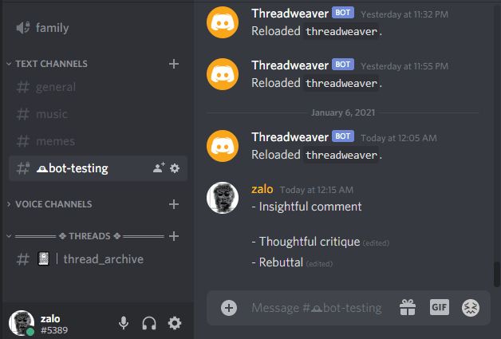

# Threadweaver
A Discord Redbot Cog that allows users to react to messages with the `:thread:` (🧵) emoji to create temporary channels based around that comment.



# Installation
Once you have a [Red Discord Bot V3](https://github.com/Cog-Creators/Red-DiscordBot) set up, execute these commands in Discord (where `[p]` is your bot's command character (usually `/`, `.`, or `!`)):
```
[p]repo add Threadweaver https://github.com/zalo/Threadweaver
[p]cog install Threadweaver threadweaver
```

Make sure your bot has permissions to manage channels and roles/permissions.

# Usage

By default, you and your users should be able to use the 🧵 emoji on any message to create threads.

In addition, these commands are introduced:
 - `[p]threadweaver_settings` - View the list of internal settings
 - `[p]threadweaver_update_setting [name] [value]` - Change an internal setting (Mod Only)
 - `[p]threadweaver_update_setting [name] [value]` - Change an internal setting
 - `[p]rename-thread [NAME]` - Rename a thread (Original Poster in Thread Only)
 - `[p]archive-thread` - Archive a thread (Original Poster in Thread Only)

(where `[p]` is your bot's command character (usually `/`, `.`, or `!`))
